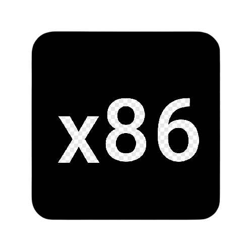

# こんにちは !

- 👋 I'm @anuragdaksh7
- 👀 I’m interested in computer programming
- 📫 [Social Media](./socialMedias.md)
- 🌱 I’m currently learning cloud computing
- You can find my resume on -> [ 📝 ](./Anurag's%20Resume.pdf)
- See my [Certificates](./certificates.md)
- Joined 18th May 2021

## skills:

    
    
    
<!-- 

 

 -->
    
    
    

 

    
    
    
<!-- 

 

-->
    
    
    

 

    
    
    

  

  

## Github Badges
 

    
    
    

 
 
&nbsp;

